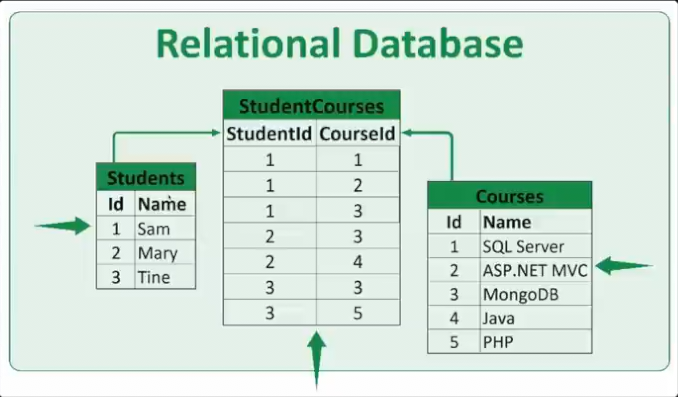

## Relational Databases

We have been using the term <em>relational</em> quite a bit, but it's time we
actually go over what that means! A <em>relational</em> database is a type of
database that stores data so that it can be easily related to other data. For
example, a `user` can have many `tweets`. There's a relationship between a `user` and their `tweet`.

In a relational database:

1. Data is typically represented in "tables".
2. Each table has "columns" or "fields" that hold attributes related to the
   record.
3. Each row or entry in the table is called a [record](<https://en.wikipedia.org/w/index.php?title=Row_(database)>).
4. Typically, each record has a unique `Id` called the [primary key](https://en.wikipedia.org/wiki/Primary_key).

### Example Relational Database

Here is an example of a small relational database. This database has 3 tables,
`Students`, `Courses`, and `StudentCourses`. The `StudentCourses` table manages
the relationship between the `Students` and the `Courses` tables.
