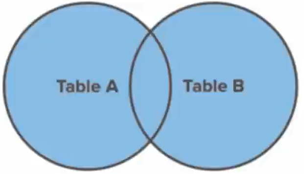

## Full Join

A `FULL JOIN` combines the result set of the `LEFT JOIN` and `RIGHT JOIN`
commands. It returns <em>all</em> records from both `table_a` and `table_b`
regardless of whether or not they have matches.

### SQLite

Like `RIGHT JOIN`s, SQLite doesn't support `FULL JOIN`s but they are still
important to know!
