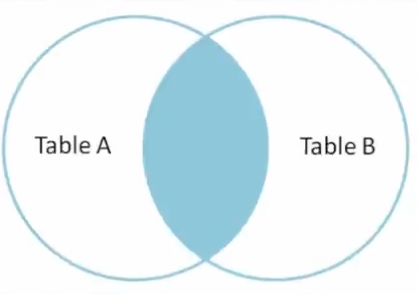

## Joins

Joins are one of the most important features that SQL offers. Joins allow us to
make use of relationships we have set up between our tables. In short, joins
allow us to query multiple tables at the <em>same time</em>.

### Inner Join

The simplest and most common type of join in SQL is the `INNER JOIN`. By
default, a `JOIN` command is an `INNER JOIN`. An `INNER JOIN` returns all of the
records in `table_a` that have matching records in `table_b` as demonstrated by
the following Venn diagram.



## On

In order to perform a join, we need to tell the database which fields should be
"matched up". The `ON` clause is used to specify these columns to join.

```sql
SELECT *
FROM employees
INNER JOIN departments
ON employees.department_id = departments.id;
```

The query above returns <em>all</em> the fields from <em>both</em> tables. The
`INNER` keyword doesn't have anything to do with the number of <em>columns</em>
returned - it only affects the number of <em>rows</em> returned.

### Assignment

Our frontend team is working on a profile page and would like to display a
user's country <em>name</em> instead of just the country's two-letter
<em>code</em>. Let's start by writing a simple join between the `users` table
and `countries` table. We will exapand on this query more in the next exercise.

- Write an `INNER JOIN` between `users` and `countries`
- Return <em>all</em> fields from both tables

**Answer:**

```sql
SELECT *
FROM users
INNER JOIN countries
ON users.country_code = countries.country_code;
```
