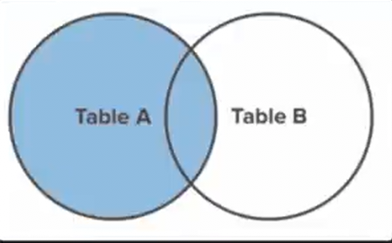

## Left Join

A `LEFT JOIN` will return every record from `table_a` regardless of whether or
not any of those records have a match in `table_b`. A left join will
<em>also</em> return any matching records from `table_b`. Here is a Venn diagram
to help visualize the effect of a `LEFT JOIN`.



A small trick you can do to make writing the SQL query easier is define an
[alias](<https://en.wikipedia.org/wiki/Alias_(SQL)>) for each table. Here's an example:

```sql
SELECT e.name, d.name
FROM employees e
LEFT JOIN departments d
ON e.dartpment_id = d.id;
```

Notice the simple alias declarations `e` and `d` for `employees` and
`departments` respectively.

Some developers do this to make their queries less verbose. That said, I
personally <em>hate it</em> because single-letter variables are harder to
understand the meaning of.

### Assignment

The <em>CashPal</em> team needs a report on all the transactions a user has
made. Join the `users` and `transactions` tables on `users.id` and
`transactions.user_id`.

Your query should return 3 fields:

1. A user's `name` as `name`
2. The sum of all of their transaction `amount`s as `sum`
3. The count of all of their transactions as `count`

- Be sure to order the data by the `sum` field in descending order.
- Be sure to still return user records of users who have no transactions.

**Answer:**

```sql
SELECT
   user.name AS name,
   sum(transactions.amount) as sum,
   count(transactions.id) AS count
    FROM users
    LEFT JOIN transactions
    ON users.id = transactions.user_id
    GROUP BY users.id
    ORDER BY sum DESC;
```
