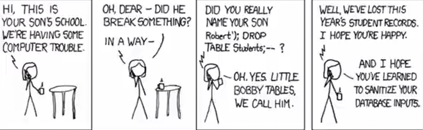

## SQL Injection

SQL is a <em>very</em> common way hackers attempt to cause damage or breach a
database. One of my favorite [XKCD](https://xkcd.com/) comics of all time demonstrates the
problem:



The joke here is that if someone was using this query:

```sql
INSERT INTO students(name) VALUES(?);
```

And the "name" of a student was `'Robert'); DROP TABLE students;--`
then the resulting SQL query would look like this:

```sql
INSERT INTO students(name) VALUES('Robert'); DROP TABLE students--);
```

As you can see, this is actually 2 queries! The first one inserts "Robert" into
the database, and the second one <em>deletes the students table</em>!

### How Do We Protect Against SQL Injection?

You need to be aware of SQL injection attacks, but to be honest theh solution
these days is to simply use a modern SQL library that sanitizes SQL inputes. We
don't often need to sanitize inputs by hand at the application level anymore.

For example, the Go standard library's SQL packages automatically protects your
inputs against SQL attacks if you [use it properly](https://go.dev/doc/database/sql-injection). In short, don't interpolate user input into raw strings yourself - make sure your database library has a way to sanitize inputs, and pass it those raw values.
